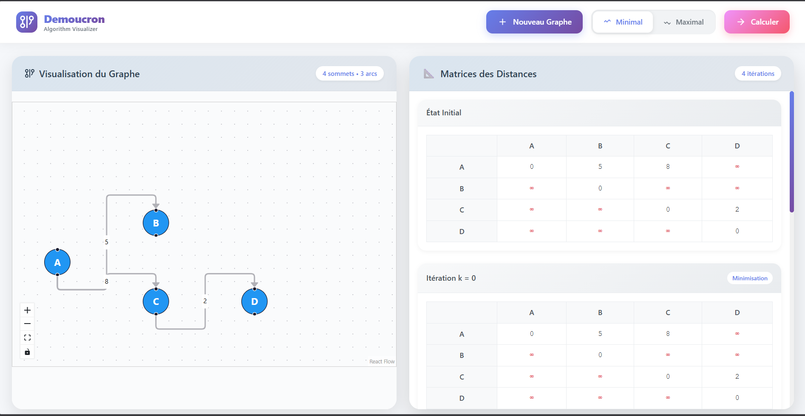

# Projet RDP : Petri Carrefour 1 routes

---

## 📸 Aperçu

<p align="center">
  
</p>

---

#### Cloner le projet ; Installer les dépendances et Lancer le projet
```bash
git clone <url-du-repository>
cd <nom-du-projet>
npm install
npm run dev